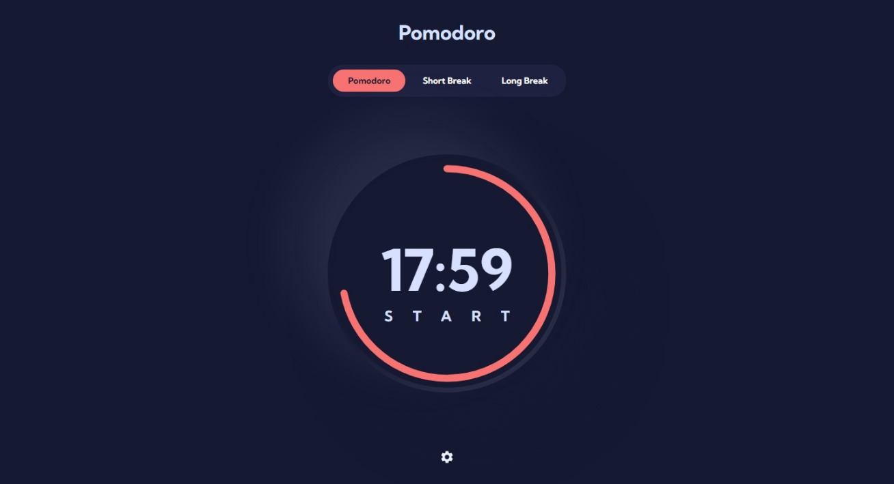

# Temporizador Pomodoro



- [Descripcion General](#descripcion-general)
- [Que Aprendi](#que-aprendi)
- [Desarrollo](#desarrollo)

## Descripcion General

La [Técnica Pomodoro](https://es.wikipedia.org/wiki/T%C3%A9cnica_Pomodoro) es un método para mejorar la administración del tiempo dedicado a una actividad que se basa en usar un temporizador para dividir el tiempo en intervalos fijos, llamados pomodoros, de 25 minutos de actividad, seguidos de 5 minutos de descanso, con pausas más largas cada cuatro pomodoros, dando asi un total de 6.

En esta ocasión, la idea evoluciona para tener 3 valores abreviados para establecer bloques de tiempo comunes de 25, 5 y 15 minutos respectivamente. Valores que pueden ser cambiados en la configuración de la aplicación.

Para mostrar el tiempo transcurrido hice uso de una barra de progreso circular la cual funciona en el sentido contrario de las agujas del reloj, y el tiempo se disminuye en consecuencia, es decir, los valores van desde la duracion del temporizador a cero

Principales Características:

- Capacidad para iniciar 3 tipos de temporizadores
- Posibilidad de cambiar el aspecto de la aplicación
- Capacidad para pausar, iniciar y reiniciar el temporizador
- Posibilidad de personalizar cada uno de los temporizadores

## Que Aprendi

### Navegadores Moviles y 100VH

Trabajar con las medidas del viewport en navegadores móviles es un completo dolor de cabeza, ya que al asignar 100vh a un elemento no se toma en cuenta el tamaño de la barra de navegación por lo que se corta parte del contenido en la parte inferior y a su vez genera un scroll innecesario, dando como consecuencia que el botón de configuración permanezca oculto al estar visible la barra de navegacion.

Encontré un excelente artículo de [CSS Tricks: The trick to viewport units on mobile](https://css-tricks.com/the-trick-to-viewport-units-on-mobile/) el cual consiste en aplicar un alto que sea igual a la altura de la ventana restando el tamaño de la barra de navegación el cual se actualiza a medida que la altura de la ventana cambia.

### Barra de Progreso con SVG

Una de las partes desafiantes de este proyecto era el botón grande con la barra de progreso y texto encima, lo cual en un principio pense hacerlo unicamente con CSS pero me di cuenta que la mejor manera era utilizando un SVG.

Debido a que no contaba con suficiente experiencia con el manejo de SVG's recurrí a unos articulos que me ayudaron bastante a contruir esa funcionalidad, asi como las animaciones para conseguir un movimiento fluido de la barra de progreso.

- [CodePen Demo using SVG Path](https://codepen.io/web-tiki/pen/qEGvMN)
- [CSS-Tricks article with using SVG Circle](https://css-tricks.com/building-progress-ring-quickly)

### useContext y useReducer

Para manejar el estado global de la aplicación hice uso de useContext y useReducer y a pesar de que nunca habia trabajado con ello antes encontre un articulo en [Dev.to - React context API state management with typescript](https://dev.to/forinda/react-context-api-state-management-with-typescript-193f) el cual me ayudó muchísimo a lograr el efecto deseado.

## Desarrollo

Las principales herramientas que utilice con este proyecto:

- [ReactJS](https://reactjs.org) - Decidi hacer uso de ReactJS para este proyecto ya que a pesar de que lo domino bastante bien aun hay conceptos que no me quedan del todo claro y queria aprender a manejar un estado global sin la necesidad de usar redux sino unicamente el context API de React.

- [Typescript](https://www.typescriptlang.org) - Para este proyecto decidi que queria tener una base solida y una buena estructura por lo que decidi usar ReactJS junto a typescript y aunque al principio el tipado de algunos datos fue un poco dificil, logre que todo encajara perfectamente.

- [SASS](https://sass-lang.com) - En un primer momento pense en utilizar algun framework para CSS como TailwindCSS o MaterialUI pero al final decidí poner a prueba mis habilidades y conocimientos de CSS utilizando unicamente el preprocesador SASS para maquetar toda la aplicación.

### Como Ejecutar el Proyecto

1. Antes que todo debera clonar el repositorio en su disco local
```bash
git clone https://github.com/axelestrada/pomodoroapp.git
cd pomodoroapp
```

2. Luego, asegurese de tener instalado Node. Vea las ultimas instrucciones [aquí](https://nodejs.org/en/download). Una vez completado este paso, verifque que [NPM](https://docs.npmjs.com/getting-started) esta disponible ejecutando el comando `npm -v` en su terminal, esto debería mostrar la versión de NPM instalada.

3. Opcionalmente puede instalar el gestor de paquetes [Yarn](https://yarnpkg.com/getting-started/install) ejecutando `npm install yarn -g` en su terminal.

4. Luego, deberá instalar las dependencias del proyecto, ejecutando el comando `npm install` o `yarn install`. El cual instalará todas las dependecias necesarias para ejecutar el proyecto.

5. Por ultimo bastará con ejecutar el comando `npm run dev` o `yarn dev`, lo cual iniciara un servidor de desarrollo al cual puede acceder desde [http://localhost:3000](http://localhost:3000) en su navegador favorito.
